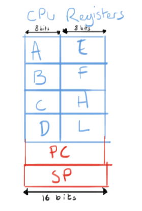

CPU Notes 
=============================

* The GameBoy has instructions & registers similar to the Intel 8080, Intel 8085, & Zilog Z80 microprocessors. 
* It has eight 8-bit registers `A,B,C,D,E,F,H,L` and two 16- bit registers `SP` & `PC`

* The Z80 is an 8-bit chip, so all the internal workings operate on one byte at a time
* A machine instruction can be anything between 1 and 3 bytes in size
* On power up the PC is set to 0x100 (256)
* Registers pairs such as HL can be created. The second portion is the low order byte `00000000 11111111` 
